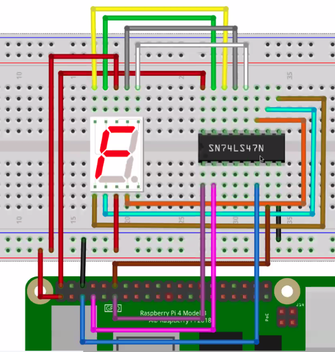

# 7seg 

### 구동 방법
```sh
1. C
    $ make
    $ ./fnd (number) # number that you want
2. Python
    $ python3 7seg.py
# make clean : cleanup a.out files
```

### 동작 과정(C)
1. WiringSetup
2. gpio 설정 (pinMode)
3. number 에 따른 pin 설정
4. 해당 gpio high 설정

### 동작 과정(Python)
1. setmode 로 gpio설정
2. setup 로 out 설정
3. number에 따른 pin 설정
4. output 로 출력

### 연결방법
- GPIO 3,4,17,18 사용,  /  7segment와 sn74l 연결 / 3.3V, 5.5V사용
