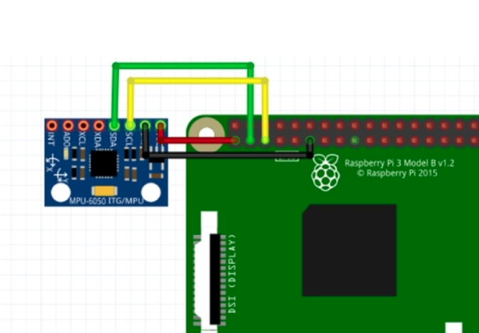

# Gyro with MPU

### 구동 방법
```sh
$ i2cdetect -y 1 #check i2c device connected
$ python3 mpu.py
```

### 동작 과정(Python)
1. SMBUS이용해서 data read
2. 센서의 감도/범위 설정
2. atan 사용해서 radian값 계산

### 연결방법
- GPIO 2,3 이용해서 SCL, SDA 에 연결  /  3.3V , GND 사용
