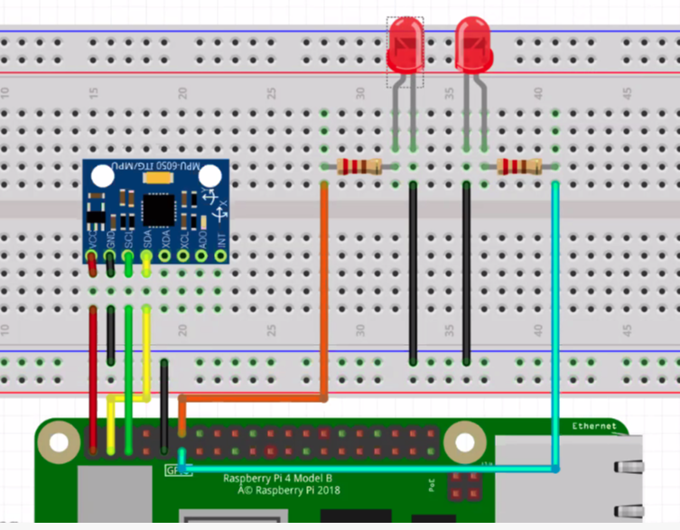

# Gyro with MPU

### 구동 방법
```sh
$ i2cdetect -y 1 #check i2c device connected
$ python3 mpu_led.py
```

### 동작 과정(Python)
1. SMBUS이용해서 data read
2. 센서의 감도/범위 설정
3. atan 사용해서 radian값 계산
4. 값 변화에 따라서 x축 변하면 18번 gpio set, y축 변하면 17번 gpio set

### 연결방법
- GPIO 2,3 이용해서 SCL, SDA 에 연결  /  3.3V , GND 사용

 <iframe width="1777" height="697" src="https://www.youtube.com/embed/glVEgN7Opqo" frameborder="0" allow="accelerometer; autoplay; encrypted-media; gyroscope; picture-in-picture" allowfullscreen></iframe>