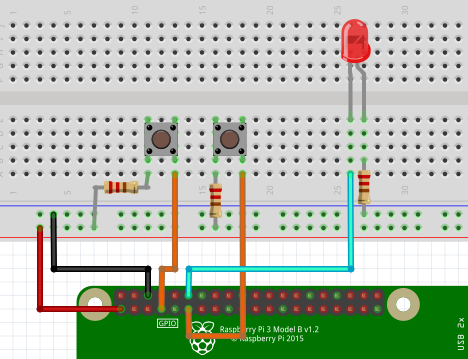

# LED with Switch
- 스위치1를 누르면 led 켜지고, 안누르면 led꺼짐
- 스위치2를 누르면 프로그램 종료
### 구동 방법
```sh
$ make
$ ./blink_sw2
```

### 동작 과정(C)
1. WiringSetup
2. gpio 설정 (4,17,18 pinMode)
3. 스위치1 상태에 따라 led set
4. 스위치2 상태에 따라 프로그램 종료

### 연결방법
- GPIO 4,17 이용해서 스위치 에 연결, 18은 led연결  /  5V , 220Ω 사용<br>

 
### 시연 영상
<br>
[led-pi-youtube](https://youtu.be/URrUO2BVo5E)