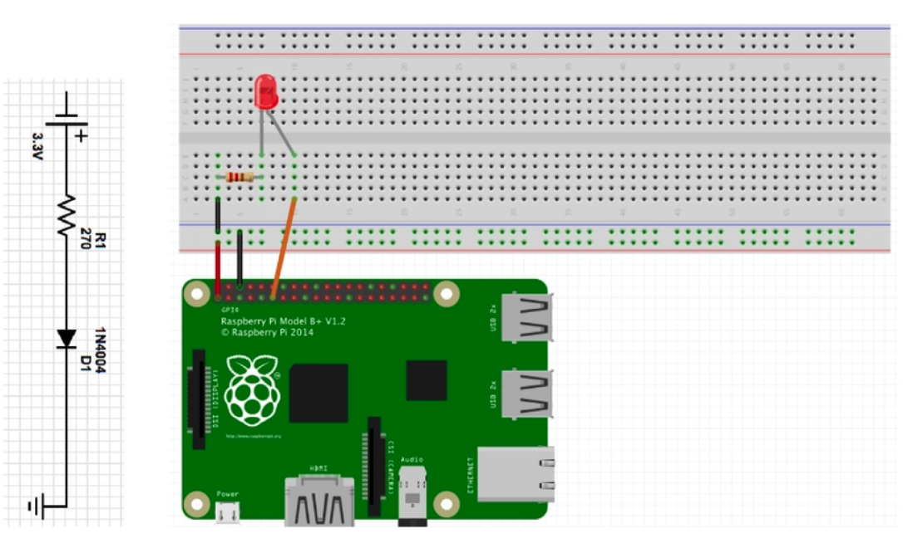

# LED on-off

### 구동 방법
```sh
$ chmod u+x led-onoff.sh
$ chmod u+x led-off.sh
$ ./led-onoff.sh
$ ./led-off.sh
```

### 동작 과정
1. /sys/class/gpio/export 에 pin을 지정
2. /sys/class/gpio/gpio18/direction 에 output direction 설정
3. /sys/class/gpio/gpio18/value 에 값을 입력(신호 전달)

### 연결방법
- GPIO 18 에 led 연결  /  3.3V & 220Ω 저항 사용
