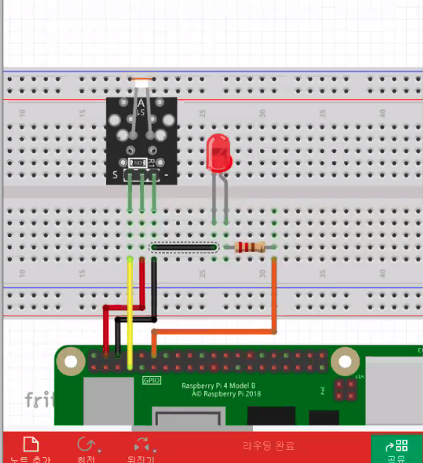

# CDS light sensor
- cds light sensor test
### 구동 방법
```sh
1. C 
    $ make
    $ ./light
```

### 동작 과정
#### C
1. wiringPiSetup
2. PinMode 를 통해 input(cds), output(led) 설정
3. digitalRead 를 통해 신로를 읽고 led 출력

### 연결방법
- GPIO 18 - led, GPIO 4 - CDS 에 연결  /  5V , GND 사용


 