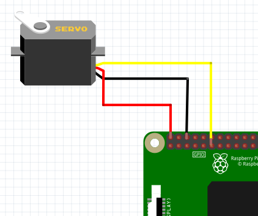

# Servo Motor
- 서보 모터 연결 및 동작
### 구동 방법
```sh
1. C 
    $ make
    $ ./motor
2. python
    $ python3 motor.py
```

### 동작 과정
#### C
1. wiringPiSerup
2. PinMode 를 통해 output 설정
3. pwm 을 통해 회전 주기 설정
#### Python
1. PWM 을 통해 ChangeDutyCycle 로 회전 주기 설정

### 연결방법
- GPIO 17 이용해서 motor 에 연결  /  3.3V , GND 사용


 