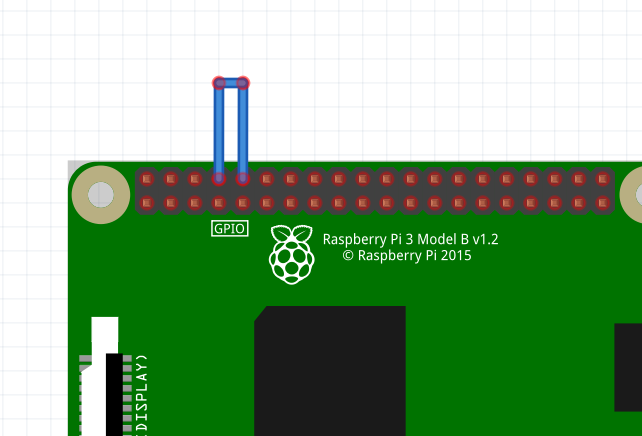

# Serial 통신
- serial 통신 test
### 구동 방법
```sh
1. C 
    $ make
    $ ./serial
2. python
    $ python3 serial.py
```

### 동작 과정
#### C
1. serialOpen
2. wiringPiSetup
3. serialPutchar --> serialGetchar 를 통해 통신 확인

#### Python
1. port.write 통해 전달
2. port.read 통해 수신

### 연결방법
- header 8,10 pin 을 short 시킨다 <br>


 