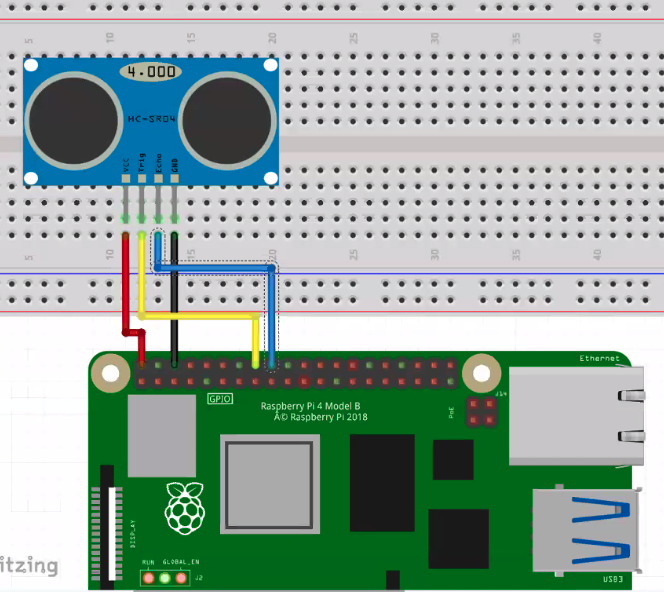

# hc-sr04 를 통한 거리 측정

### 구동 방법
```sh
1. C 
    $ make
    $ ./waves
2. python
    $ python3 waves.py
```

### 동작 과정
#### C
1. wiringPiSetup
2. GPIO input, output 설정(echo, trigger)
3. digitalread 를 통해 echo가 도착했는지 확인
4. 파동의 속도를 이용해서 시간의 차, 속도를 이용한 거리 계산

#### Python
1. GPIO.input 을 통해 echo 도달 시간 측정
2. 파동의 속도를 이용해서 거리 계산

### 연결방법
- GPIO 23, 24 를 trig, echo 에 연결시킨다 / 5V, GND사용


 