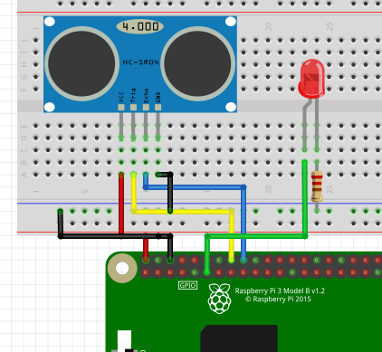

# hc-sr04 를 통한 예제
- 측정 거리가 10cm 초과이면 led on, 이하이면 led off
### 구동 방법
```sh
1. C 
    $ make
    $ ./waves_ex
```

### 동작 과정
#### C
1. wiringPiSetup
2. GPIO input, output 설정(echo, trigger)
3. digitalread 를 통해 echo가 도착했는지 확인
4. 파동의 속도를 이용해서 시간의 차, 속도를 이용한 거리 계산
5. 거리에 따라 GPIO17에 led 신호 
리 계산

### 연결방법
- GPIO 23, 24 를 trig, echo 에 연결시킨다 / 5V, GND사용
- GPIO 17 에 led 연결

 