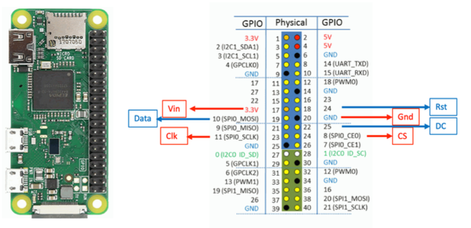
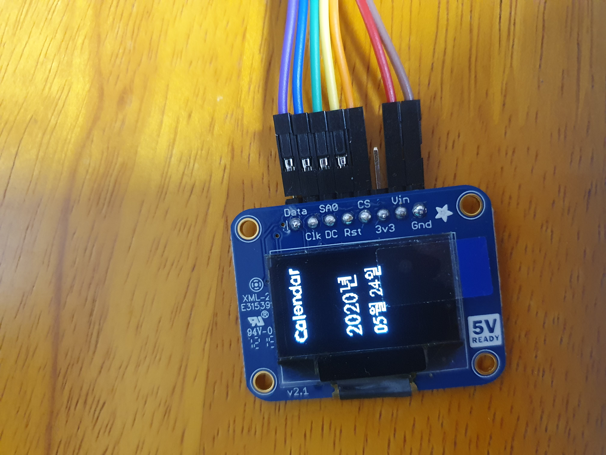
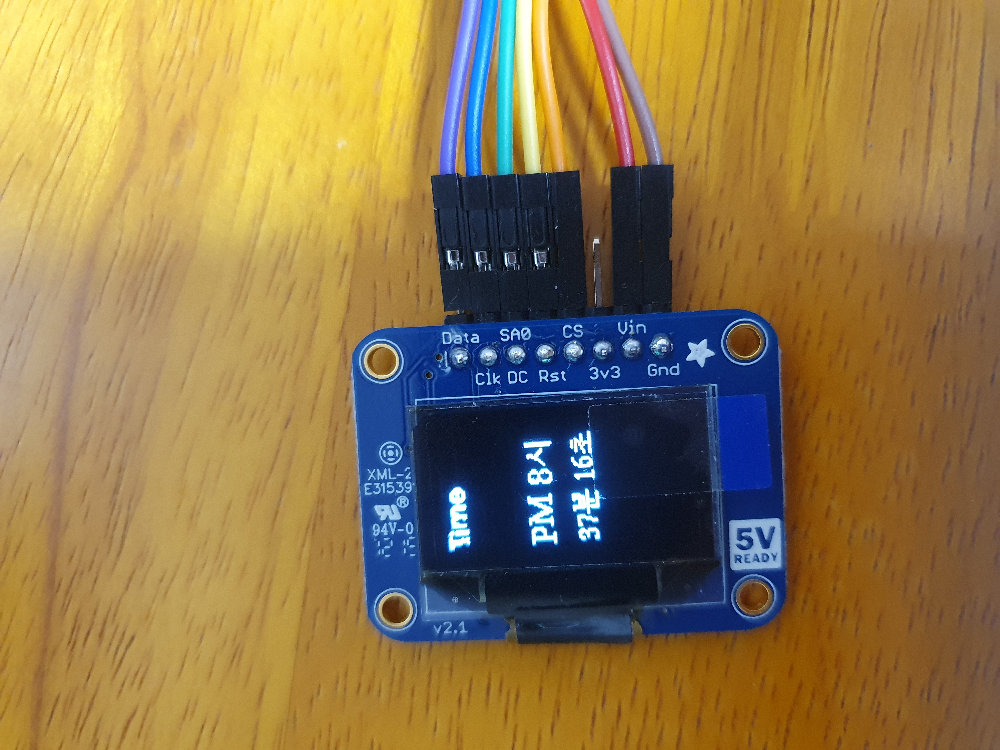

# Display 이용한 달력/시계 출력
- 스위치를 누를 때마다 모드가 바뀌도록 한다.
- 디스플레이에 세로로 표시한다.
### 구동 기기
- RasberryPi Zero
- [128*64 OLED display](https://adafru.it/326)

### 구동 방법
```sh
$ python3 calendar.py
```

### 동작 과정
1. Display setup
2. Switch setup(인터럽트 사용해서 항시 입력대기)
3. 90도 회전을 위해서 영역을 2부분으로 나누어줌
4. 해당영역에 텍스트 표시

### 연결방법
- 17~24번 pin사용해서 display 연결
- 4번(GND), GPIO17번 switch 에 연결


 
### 시연 
<br>
<br>
